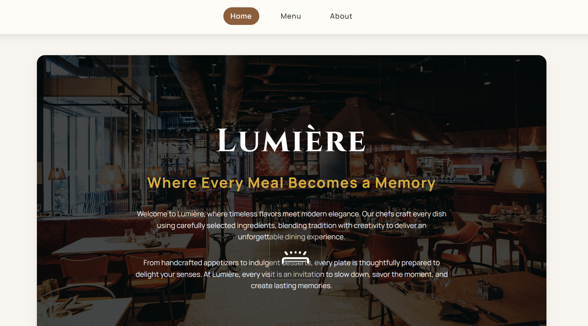
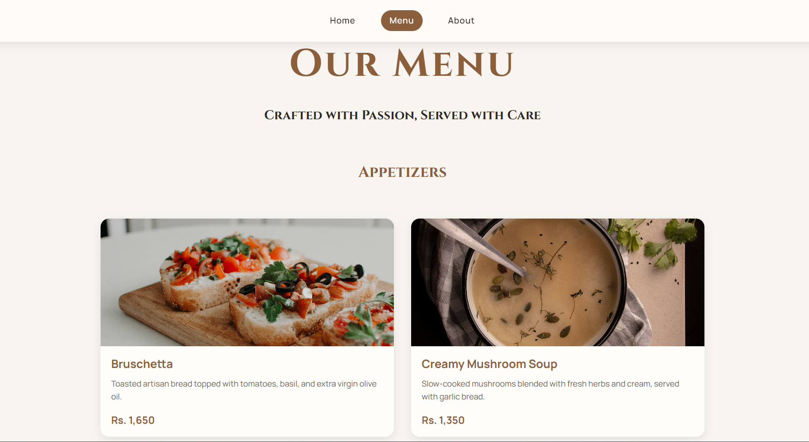
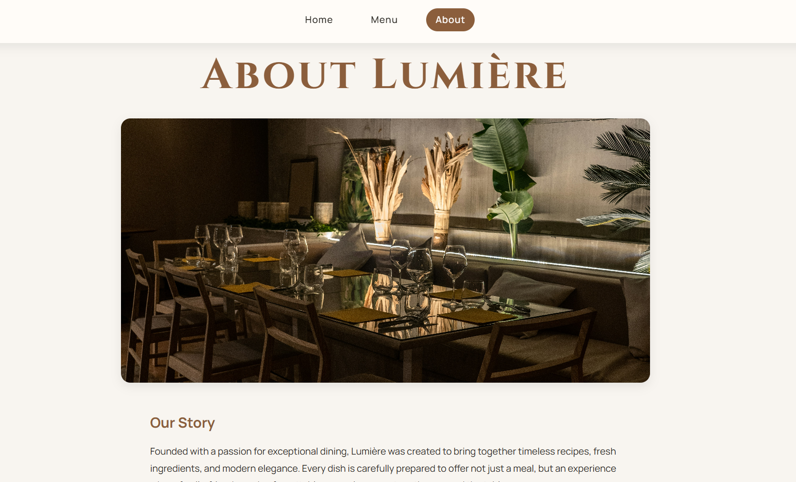

# Lumière Restaurant

A modern restaurant website built as part of **The Odin Project** Full Stack JavaScript curriculum. This project focuses on practicing **Webpack**, **ES6 modules**, and **dynamic DOM manipulation** by creating a multi-page experience entirely with JavaScript.

## Live Demo

**Live:** (https://abdullahrashid359.github.io/restaurant-page/)

## Screenshots





## Features

* Elegant restaurant-themed homepage
* Interactive tab navigation (Home, Menu, About)
* Dynamic page rendering using JavaScript
* Modular code structure with ES6 modules
* Webpack asset management for images and styles
* Responsive card layout for the menu
* Hover effects and active navigation states
* Modern typography and clean UI

## Built With

* HTML5
* CSS3
* JavaScript (ES6)
* Webpack
* Google Fonts (Cinzel & Manrope)

## What I Learned

Through this project, I gained hands-on experience with:

* Setting up and configuring Webpack
* Organizing applications using ES6 modules
* Dynamically creating and rendering DOM elements
* Importing and bundling images with Webpack
* Implementing tabbed navigation without reloading the page
* Structuring a project into reusable, maintainable modules
* Building a complete interface using JavaScript instead of static HTML

## Project Structure

```text
src/
├── images/
├── homepage.js
├── menu.js
├── about.js
├── index.js
├── style.css
└── template.html
```

## Running Locally

1. Clone the repository

```bash
git clone https://github.com/abdullahrashid359/restaurant-page.git
```

2. Navigate to the project directory

```bash
cd restaurant-page
```

3. Install dependencies

```bash
npm install
```

4. Start the development server

```bash
npx webpack serve
```

5. Build the production bundle

```bash
npx webpack
```

## Acknowledgements

This project was completed as part of **The Odin Project** JavaScript course in Full Stack JavaScript Path.

https://www.theodinproject.com/lessons/node-path-javascript-restaurant-page
